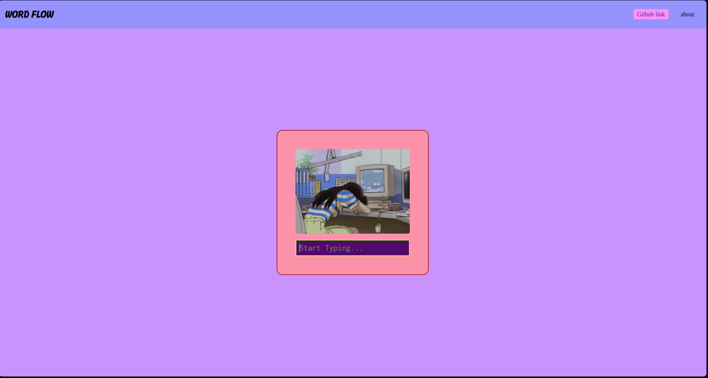
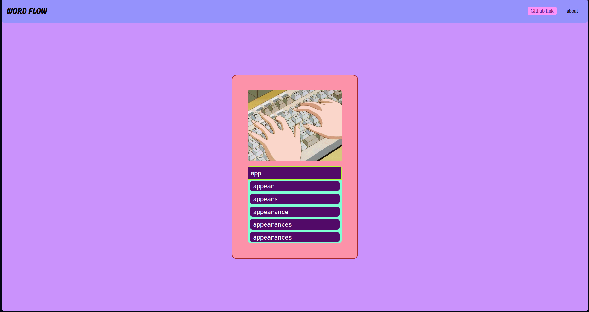

# wordflow
WordFlow is a simple autocomplete tool built using Flask and Python. It suggests and corrects words based on a given dataset, helping users find the right words faster and more accurately.

website link: []

## Features
Autocomplete: Get word suggestions as you type in the search bar.
Data Processing: Cleaned and preprocessed data for efficient search. 

## Screenshots

Page interface 

Page when you start typing 

## Usage
1. Clone the repository: git clone [Word flow](https://github.com/yuyi-hao/WordFlow.git)
2. Install dependencies: pip install -r requirements.txt
3. Run the Flask app: python app.py
4. Visit http://localhost:5000 in your web browser.

## Project Structure
1. app.py: Main Flask application that serves the user interface and handles requests.
2. src/: Contains the logic for creating and using the prefix tree.
3. static/: Holds static assets such as CSS styles and images.
4. templates/: Contains the HTML templates for the user interface.
5. data/: Store cleaned data and other necessary files.

## References
- [Flask Documentation](https://flask.palletsprojects.com/en/2.2.x/quickstart/)
- [Prefix Tree (Trie) Data Structure](https://en.wikipedia.org/wiki/Trie)
  
## License
This project is licensed under the MIT License.

